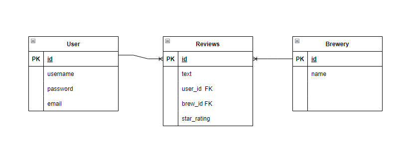

# Brew Browse

## Goal

The goal of this project is to create a website that allows the user to search for Breweries based on user provided location. 
The user will be able to leave reviews for Breweries and view reviews left by other users.

## Demographic

The targeted demographic for this website will be users that frequently travel and enjoy visiting breweries. 

## Data

The majority of the data used for this project, will be pulled from the Open Brewery API, https://www.openbrewerydb.org/.
The API provides the name of Breweries, the locations, and the websites if the Brewery has one. 
 

 ## Outline 

 ### Database Schema

 ### Possible API issues
One of the issues that may arise is that the API is community driven and maintained. 
Therefore, it is possible that some Breweries may no longer be in business or in the same location, but the API may not reflect those changes yet.

 ### Sensitive Information

The project will need to securely store user information such, username, password, and email. 

 ### Functionality 

The primary function of the project is to allow users to enter a location, such as a city, and get a list of local Breweries in return. 
The user will also be able to create an account and leave a review for Breweries. 

 ### User Flow

 The flow of the project would be:
- Creating an account
- Searching for Breweries near the intended location
- Leaving a review of a Brewery if one desires

 ### Beyond CRUD